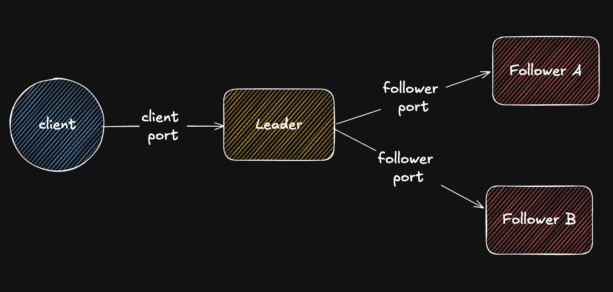

# Protocol specification

This document describes the wire protocol and data model implemented in
`common/src/`. It reflects the current state of the code, including parts
that are specified here but not yet implemented on the receiving end
(noted where relevant).

## 1. Data model

### 1.1 Event

The unit of replication. Defined in `common/src/event.rs`.

```
enum Event {
    Deposit        { account: String, amount: i64 }
    Withdraw       { account: String, amount: i64 }
    TransferDebit  { transfer_id: u64, from: String, amount: i64 }
    TransferCredit { transfer_id: u64, to: String,   amount: i64 }
}
```

`amount` is an integer number of cents. A transfer is represented as two
separate events, `TransferDebit` and `TransferCredit`, sharing the same
`transfer_id`. The leader always appends them consecutively, but a
follower that is behind may apply one before receiving the other.

### 1.2 LogEntry

```
struct LogEntry {
    offset: u64,
    event: Event,
}
```

Offsets are assigned by the leader, start at 1, and increase by exactly 1
per entry with no gaps. Offset 0 means "no entries applied yet" and is
used as the default subscribe position for a new follower.

## 2. Wire framing

Every message on every connection, regardless of type, uses the same
framing, implemented in `common/src/wire.rs`:

```
+------------------+---------------------------+
| length (u32, BE) | payload (JSON, length B)   |
+------------------+---------------------------+
```

Payloads are serialized with `serde_json`. Message boundaries are
determined entirely by the length prefix; JSON parsing never has to guess
where a message ends.

## 3. Client protocol

A client connects to a node's client port. Every message from the client
is one `ClientRequest`; every reply is exactly one `ClientResponse`. This
is a strict request/response cycle - one outstanding request at a time,
no pipelining.

### 3.1 ClientRequest

```
enum ClientRequest {
    Deposit    { account: String, amount: i64 }
    Withdraw   { account: String, amount: i64 }
    Transfer   { from: String, to: String, amount: i64 }
    GetBalance { account: String, read_after: Option<u64> }
}
```

`read_after`, when present, means: do not answer until this node has
applied at least this offset. This is the read-your-own-writes mechanism.
Enforcement is specified here but not yet implemented (it is a no-op on
the leader, since the leader is always at least as caught up as any
offset it has itself handed out; it will matter once a client can read
from a follower).

### 3.2 ClientResponse

```
enum ClientResponse {
    WriteAck  { offset: u64 }
    Balance   { account: String, amount: i64, as_of_offset: u64 }
    NotLeader { leader_addr: Option<String> }
    Error     { message: String }
}
```

- `WriteAck.offset` is the offset of the resulting log entry. For a
  transfer, this is the offset of the `TransferCredit` entry (the later
  of the two).
- `NotLeader` is returned by a follower if it receives a write request.
  A follower only ever answers `GetBalance`. (Not yet implemented -
  `follower.rs` does not exist yet.)
- `Error` is returned for a rejected write, e.g. insufficient funds. This
  rejection happens before anything is appended to the log.

### 3.3 Write validation

A `Withdraw` or `Transfer` is rejected with `ClientResponse::Error` if the
source account's current balance is less than the requested amount. This
check happens exactly once, on the leader, before the event is appended.
Once an event exists in the log, every replica applies it unconditionally.

## 4. Replication protocol

A follower connects to the leader's follower port (separate from the
client port). This connection speaks `ReplicationMessage` only, and is
long-lived.

```
enum ReplicationMessage {
    Subscribe { from_offset: u64 }
    Entry(LogEntry)
    Heartbeat { leader_offset: u64 }
}
```

### 4.1 Handshake

The follower sends exactly one `Subscribe { from_offset }` as its first
message, where `from_offset` is the highest offset it has already
applied (0 for a brand new follower with an empty log).

### 4.2 Stream

The leader responds with a stream of `Entry` messages, in two phases that
the follower does not need to distinguish between:

1. Every entry with offset greater than `from_offset` that the leader
   already had at the moment it received `Subscribe` ("backlog"), sent in
   offset order.
2. Every entry committed after that moment, indefinitely, in commit order.

The connection has no defined end; it stays open and entries are pushed
as they are committed. The leader implementation guarantees phases 1 and
2 together are gap-free and duplicate-free: it reads the backlog and
subscribes to future entries under the same lock used for appending, so
no entry can be committed in between and be missed or double-sent.

### 4.3 Heartbeat

Specified, not yet sent by the current leader implementation. Reserved
for a periodic keepalive carrying the leader's current offset, so
replication lag is observable even during periods with no new writes.

## 5. Topology


