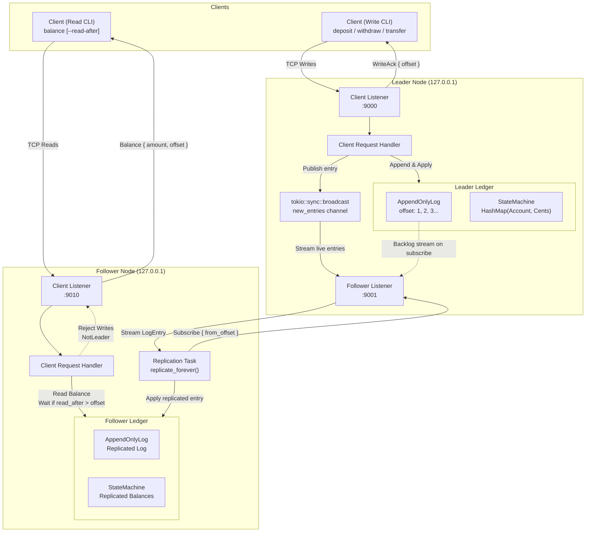
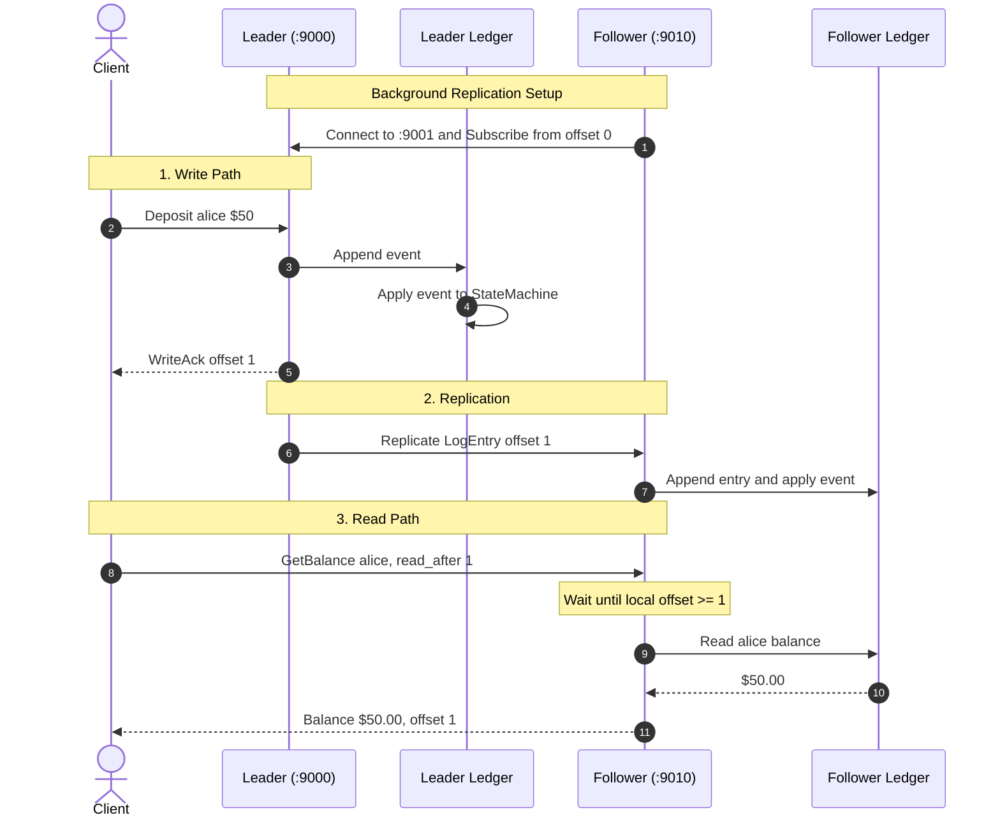

### Architecture Diagram

```mermaid
flowchart TB
    subgraph Clients["Clients"]
        CLI_Write["Client (Write CLI)<br/>deposit / withdraw / transfer"]
        CLI_Read["Client (Read CLI)<br/>balance [--read-after]"]
    end

    subgraph LeaderNode["Leader Node (127.0.0.1)"]
        direction TB
        L_ClientPort["Client Listener<br/>:9000"]
        L_FollowerPort["Follower Listener<br/>:9001"]
        
        L_Handler["Client Request Handler"]
        L_Bcast["tokio::sync::broadcast<br/>new_entries channel"]

        subgraph L_Ledger["Leader Ledger"]
            L_Log["AppendOnlyLog<br/>offset: 1, 2, 3..."]
            L_State["StateMachine<br/>HashMap(Account, Cents)"]
        end

        L_ClientPort --> L_Handler
        L_Handler -->|Append & Apply| L_Ledger
        L_Handler -->|Publish entry| L_Bcast
        L_Bcast -->|Stream live entries| L_FollowerPort
        L_Log -.->|Backlog stream on subscribe| L_FollowerPort
    end

    subgraph FollowerNode["Follower Node (127.0.0.1)"]
        direction TB
        F_ClientPort["Client Listener<br/>:9010"]
        F_Handler["Client Request Handler"]
        F_ReplTask["Replication Task<br/>replicate_forever()"]

        subgraph F_Ledger["Follower Ledger"]
            F_Log["AppendOnlyLog<br/>Replicated Log"]
            F_State["StateMachine<br/>Replicated Balances"]
        end

        F_ClientPort --> F_Handler
        F_Handler -->|Read Balance<br/>Wait if read_after > offset| F_Ledger
        F_Handler -.->|Reject Writes<br/>NotLeader| F_ClientPort
        F_ReplTask -->|Apply replicated entry| F_Ledger
    end

    CLI_Write -->|"TCP Writes"| L_ClientPort
    L_ClientPort -->|"WriteAck { offset }"| CLI_Write

    CLI_Read -->|"TCP Reads"| F_ClientPort
    F_ClientPort -->|"Balance { amount, offset }"| CLI_Read

    F_ReplTask -->|"Subscribe { from_offset }"| L_FollowerPort
    L_FollowerPort -->|"Stream LogEntry"| F_ReplTask
```

### Sequence Diagram

```mermaid
sequenceDiagram
    autonumber

    actor Client
    participant L as Leader (:9000)
    participant LL as Leader Ledger
    participant F as Follower (:9010)
    participant FL as Follower Ledger

    Note over F,L: Background Replication Setup
    F->>L: Connect to :9001 and Subscribe from offset 0

    Note over Client,L: 1. Write Path
    Client->>L: Deposit alice $50
    L->>LL: Append event
    LL->>LL: Apply event to StateMachine
    L-->>Client: WriteAck offset 1

    Note over L,F: 2. Replication
    L->>F: Replicate LogEntry offset 1
    F->>FL: Append entry and apply event

    Note over Client,F: 3. Read Path
    Client->>F: GetBalance alice, read_after 1
    Note over F: Wait until local offset >= 1
    F->>FL: Read alice balance
    FL-->>F: $50.00
    F-->>Client: Balance $50.00, offset 1
```